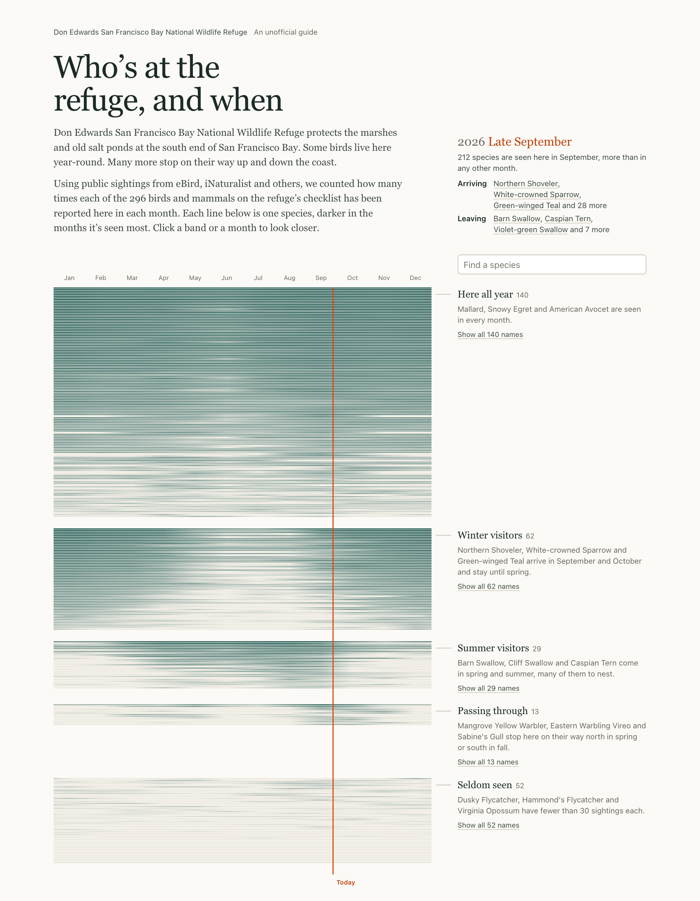

# Who's at the refuge, and when

This site shows which birds and mammals you can expect at [Don Edwards San Francisco Bay National Wildlife Refuge](https://www.fws.gov/refuge/don-edwards-san-francisco-bay) in each month of the year. It covers all 296 species on the refuge's checklist, using about 1.6 million sightings that birders and naturalists have shared.

### [Open the guide](https://aksheyd.github.io/desfb/)

[](https://aksheyd.github.io/desfb/data/species.json)
[](https://github.com/aksheyd/desfb/actions/workflows/sync-data.yml)
[](https://github.com/aksheyd/desfb/actions/workflows/pages.yml)

[](https://aksheyd.github.io/desfb/)

## What you can do

- **See the whole year at once.** Each species is a line from January to December, darker in the months it's seen most.
- **Find out who's around now.** The orange line marks today, and the box at the top lists which species are arriving and which are leaving.
- **Pick a month.** Click a month, such as April, to see which species are usually there.
- **Meet the species.** Click a group to open it, then step through the species one at a time. Each card has a photo, the best months to look, and how often the species has been seen. The arrow keys, or W, A, S and D, work too.
- **Look one up.** Search by common or scientific name, including older names from the 2008 checklist.

## What the data shows

- The Mallard and the Snowy Egret are the most-reported species here, with about 40,000 sightings each.
- September and October are the busiest months, with more than 200 species each.
- Nearly half the species live here all year. About 60 more come only for the winter.
- The list includes 27 mammals, among them harbor seals, jackrabbits and a couple of reported mountain lions.

## Where the numbers come from

- Sightings are observations that people shared on eBird, iNaturalist and similar apps. [GBIF](https://www.gbif.org/) collects them, and this project counts them by month inside an outline of the refuge's shoreline.
- The species list is the refuge's 2008 U.S. Fish and Wildlife Service checklist.
- Photos come from iNaturalist, under the Creative Commons license credited on each card.
- Every Monday, the data sync pulls fresh counts and photos and republishes the page. The badges above show the date of the current data and whether the last sync and deploy worked.

This is an unofficial guide, not affiliated with the U.S. Fish and Wildlife Service. For hours, trails and directions, see the [official refuge site](https://www.fws.gov/refuge/don-edwards-san-francisco-bay).

<details>
<summary>For developers</summary>

```bash
python3 scripts/build_species.py         # refresh data/species.json from GBIF and iNaturalist (several minutes)
python3 scripts/build_site.py            # render site/template.html with the data into dist/
python3 -m http.server --directory dist  # preview at http://localhost:8000
```

The scripts use only the Python 3 standard library. Pushes to `main` that touch `site/`, `data/` or `scripts/build_site.py` deploy through `.github/workflows/pages.yml`, and `.github/workflows/sync-data.yml` runs the weekly sync.

</details>
